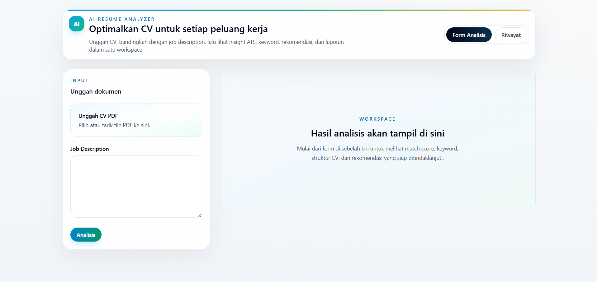
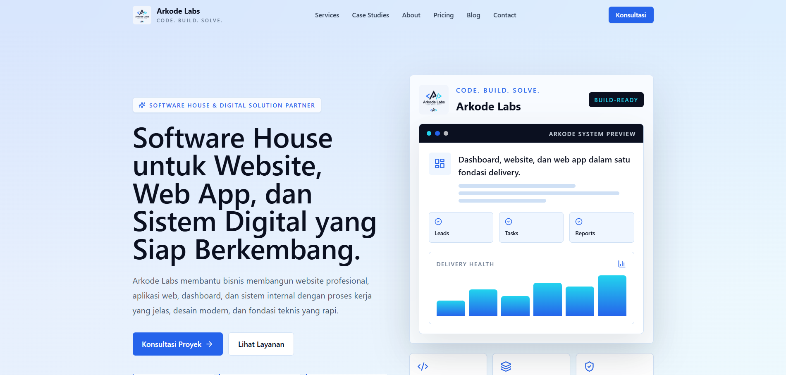
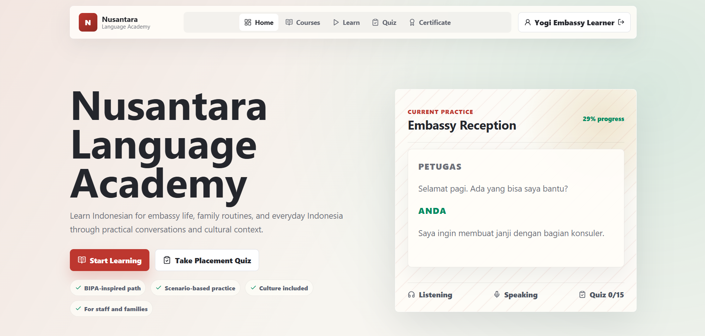
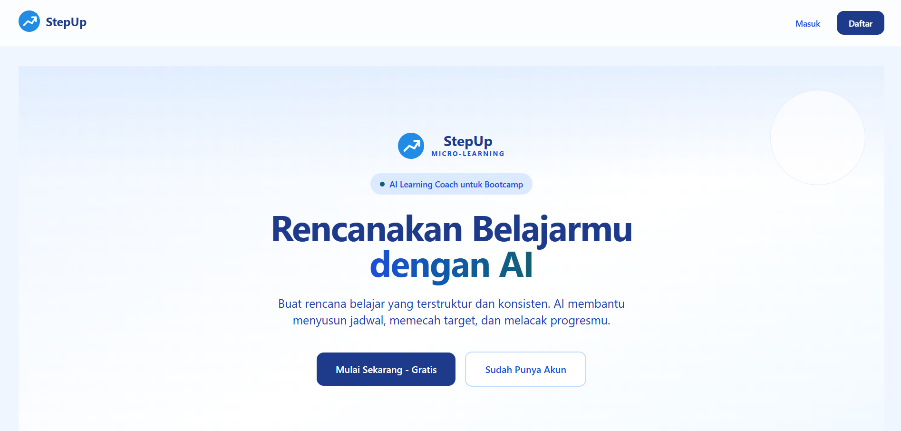

# Hi, I'm Yogi Khairul Umam 👋

## 🚀 Aspiring AI Engineer | Web Developer | Machine Learning | Python | Data Science | Cloud Engineering

I am a technology enthusiast based in Jakarta, Indonesia, with a strong interest in Artificial Intelligence, Machine Learning, Web Development, Cloud Engineering, and Data Science.

I am currently learning and developing AI-based web solutions through Dicoding Academy, Microsoft Elevate Training Center, Coding Camp 2026 powered by DBS Foundation, and AWS AI Academy 2026.

I enjoy building practical digital products that combine web development, AI integration, data processing, and user-focused design.

---

## 🧠 About Me

- 🌱 Currently learning AI Engineering, Machine Learning, Python, Data Science, and Cloud Engineering
- 💻 Interested in AI-powered web applications, full-stack development, and data-driven solutions
- 🤖 Experienced in Prompt Engineering and AI-based application development
- ☁️ Learning AWS cloud concepts and cloud-based AI solutions
- 🎯 Career goal: Becoming a professional AI Engineer and Web Developer
- 📍 Based in DKI Jakarta, Indonesia

---

## 🛠️ Tech Skills

### Programming & Web Development
- Python
- JavaScript
- TypeScript
- PHP
- HTML
- CSS
- React.js
- Vite
- FastAPI
- CodeIgniter
- Tailwind CSS

### AI, Data & Machine Learning
- Artificial Intelligence
- Machine Learning Fundamentals
- Data Science
- Data Processing
- Prompt Engineering
- AI Engineering
- Model Evaluation
- Prediction Systems

### Tools & Concepts
- Git & GitHub
- MySQL
- Database Design
- System Analysis
- Cloud Engineering
- AWS Cloud Concepts
- Software Testing
- Pytest
- Vitest
- Playwright
- System Usability Scale
- Black Box Testing

---

## 📌 Featured Projects

### 1. AI Resume Analyzer
A full-stack AI-powered application that analyzes CV compatibility with job descriptions using ATS scoring, keyword matching, and AI-assisted recommendations.

**Key Features:**
- PDF upload and CV validation
- Text extraction
- Keyword matching
- ATS scoring
- Job description comparison
- AI-assisted recommendations
- SWOT insights
- Skill recommendations
- Downloadable reports

**Tech Stack:** React, TypeScript, FastAPI, Python, Vite, Tailwind CSS, Pytest, Vitest

🔗 **Live Demo:** [https://isi-link-demo-ai-resume-analyzer.com ](https://ai-resume-analyzer-sigma-coral.vercel.app/)
💻 **Repository:** https://github.com/YogiKUmam/ai-resume-analyzer
---

### 2. Arkode Labs — Software House Website
A responsive company profile website for a software house, featuring services, case studies, pricing, blog, contact, and privacy pages.

**Key Features:**
- Home, Services, Case Studies, About, Pricing, Blog, Contact, and Privacy pages
- Reusable UI components
- Responsive design
- Basic SEO implementation
- Portfolio and service showcase

**Tech Stack:** React, TypeScript, Vite, React Router, Tailwind CSS, Vitest

🔗 **Live Demo:** [https://isi-link-demo-arkode-labs.com  ](https://arkodelabs.vercel.app/)
💻 **Repository:** [https://github.com/YogiKUmam/arkode-labs-website](https://github.com/YogiKUmam/Arkode/)
---

### 3. Nusantara Language Academy
An interactive Indonesian language-learning website for foreign learners, students, and families, featuring learning modules, quizzes, certificates, and an admin dashboard.

**Key Features:**
- Learning modules
- Interactive quizzes
- Certificate generation
- Admin dashboard
- Progress tracking
- Audio exercises using Web Speech API

**Tech Stack:** React, JavaScript, Vite, Custom CSS, Web Speech API, localStorage, Playwright

🔗 **Live Demo:** [https://isi-link-demo-nusantara-language-academy.com ](https://nusantara-language-academy.vercel.app/) 
💻 **Repository:** [https://github.com/YogiKUmam/nusantara-language-academy](https://github.com/YogiKUmam/Nusantara-Language-Academy)
---

### 4. StepUp AI Learn
An AI-powered learning planning application that transforms user goals into personalized and trackable study plans with an AI Learning Coach.

**Key Features:**
- Authentication
- User dashboard
- AI Learning Coach
- Study plan generation
- Calendar integration
- Progress tracking
- Gemini AI integration

**Tech Stack:** Full-Stack Development, Gemini AI Integration, Prompt Engineering, Software Testing, Product Development

🔗 **Live Demo:** https://isi-link-demo-stepup-ai-learn.com  
💻 **Repository:** https://github.com/YogiKUmam/stepup-ai-learn
---

### 5. Odentic
A web-based dental clinic prototype for consultation, examination scheduling, patient registration, and payment verification.

**Key Features:**
- Patient registration and login
- Consultation booking
- Examination booking
- Doctor and clinic data management
- Payment verification
- SUS testing result: 83 / Grade A / Excellent

**Tech Stack:** PHP, JavaScript, CodeIgniter, MySQL, HTML, CSS

---

## 🎓 Education

**Universitas Negeri Malang**  
Bachelor of Engineering in Informatics Engineering  
Focus: Web Development  
2018 - 2022

---

## 📚 Training & Bootcamps

- **Dicoding Academy** — Bootcamp AI
- **Microsoft Elevate Training Center** — AI Engineering, AI Development, Prompt Engineering, Python
- **Coding Camp 2026 powered by DBS Foundation** — AI Engineering, Machine Learning, Python, Data Science
- **AWS AI Academy 2026** — AI Engineering, Kiro Development, Cloud Engineering, Machine Learning

---

## 📜 Certifications

- Belajar Dasar Manajemen Proyek
- Memulai Pemrograman dengan Python
- AI Ethics
- Belajar Penggunaan Generative AI
- Belajar Dasar Visualisasi Data

---

## 📫 Connect With Me

- Email: yogiumam210699@gmail.com
- LinkedIn: https://linkedin.com/in/yogi-khairul-umam
- GitHub: https://github.com/YogiKUmam
- Portfolio: https://yogi-builds.vercel.app/

---

## 💡 Personal Motto

Keep learning, keep building, and keep improving through technology.
